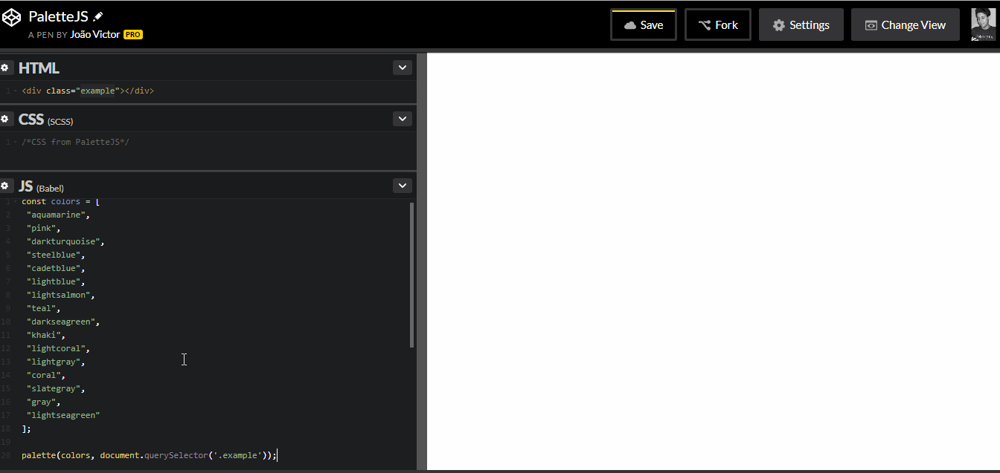
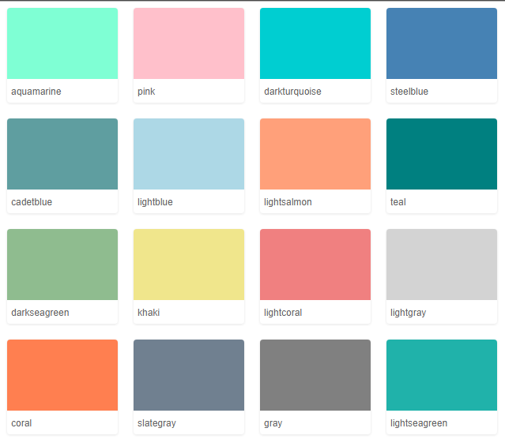

# Palette-js

Are you building a Design System or just a style guide? So, **palettejs** may help you! Add a beautiful palette colors to your project with a single line of code.

This JS source code is a modern es2015, so keep it in mind for browser support.

## How to install

```js
npm install palette-js
```
OR

Just import the CDN source code
```html
<script src="https://cdn.rawgit.com/jotavejv/palette-js/d482cf3/dist/palette.min.js"></script>
```
## How does it work

The JS code will inject to your project the required CSS style for the list of colors that you will add to the plugin. Then it will create a list of colors inside of the parent selector that you need especify.
The JS handle **copy to clipboard** for you too! Just click at any color and it will add that especific color to your clipboard :)


## How to use

You need especify a **array** of colors and the especific parent selector that will wrap these colors.

```js
const colors = [
"aquamarine",
"pink",
"darkturquoise",
"steelblue",
"cadetblue",
"lightblue",
"lightsalmon",
"teal",
"darkseagreen",
"khaki",
"lightcoral",
"lightgray",
"coral",
"slategray",
"gray",
"lightseagreen"
];

palette(colors, document.querySelector(".example"));
```






Codepen link **[Demo](https://codepen.io/jotavejv/pen/wezbwy/)**
